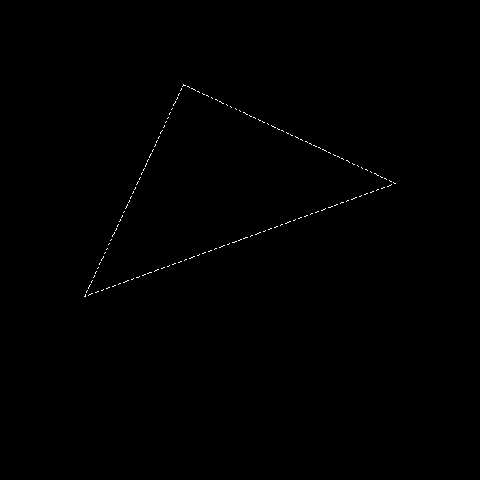
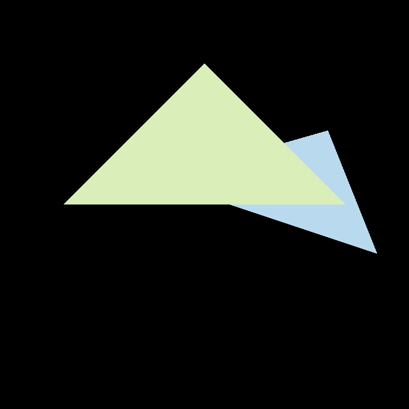
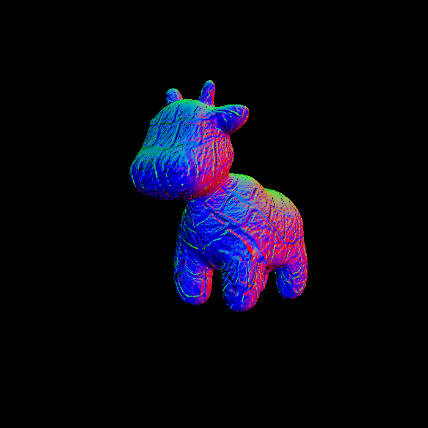
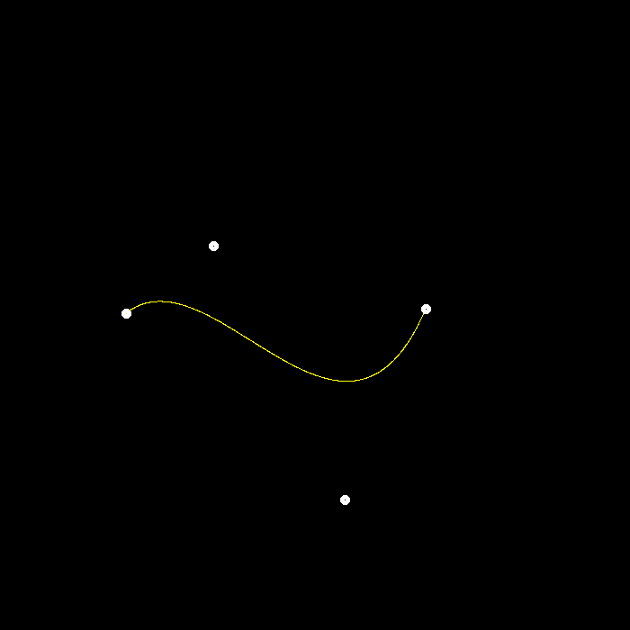
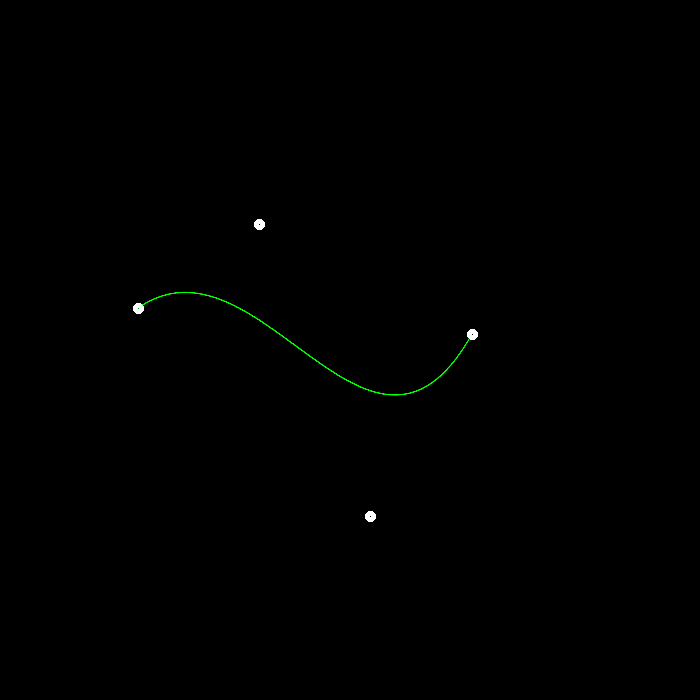
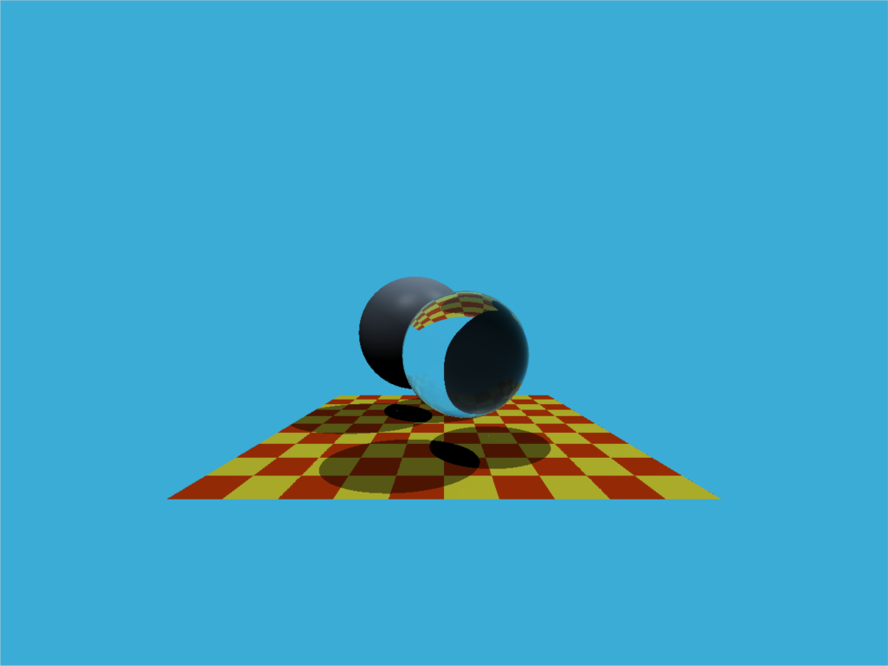
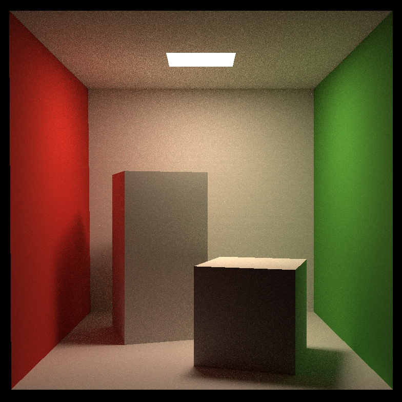
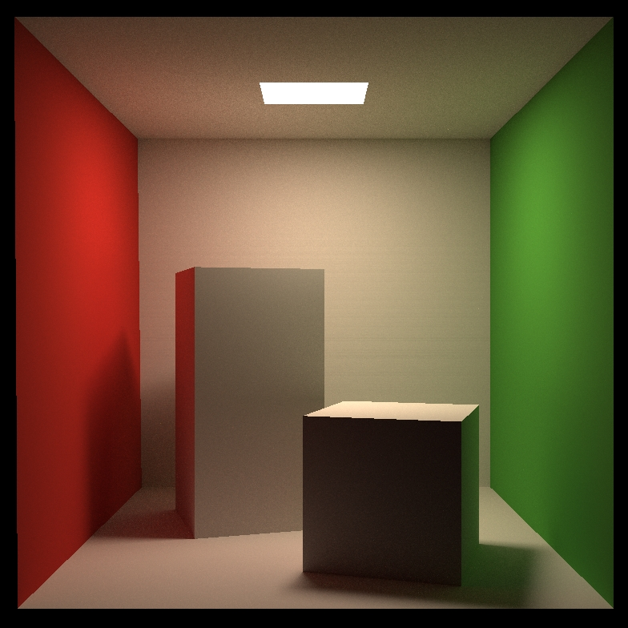

# GAMES101 Homework 1~8 2021Edition

GAMES101 现代计算机图形学入门 作业1~8 2021版

虚拟机链接：https://pan.baidu.com/s/198u7ETgY7h24IuYCYslmlw 密码：p085

代码框架链接：https://pan.baidu.com/s/1s3QC5EYtliUM48O7QkJ_jQ 密码：ibk9

笔记链接：https://tanyuu.github.io/2024.01-07/GAMES101%E7%AC%94%E8%AE%B0/

## 作业1 旋转与投影

## 作业2 Triangles and Z-buffering

## 作业3 Pipeline and Shading

## 作业4 Bézier 曲线

## 作业5 光线与三角形相交

## 作业6 加速结构

## 作业7 路径追踪

## 作业8 质点弹簧系统

